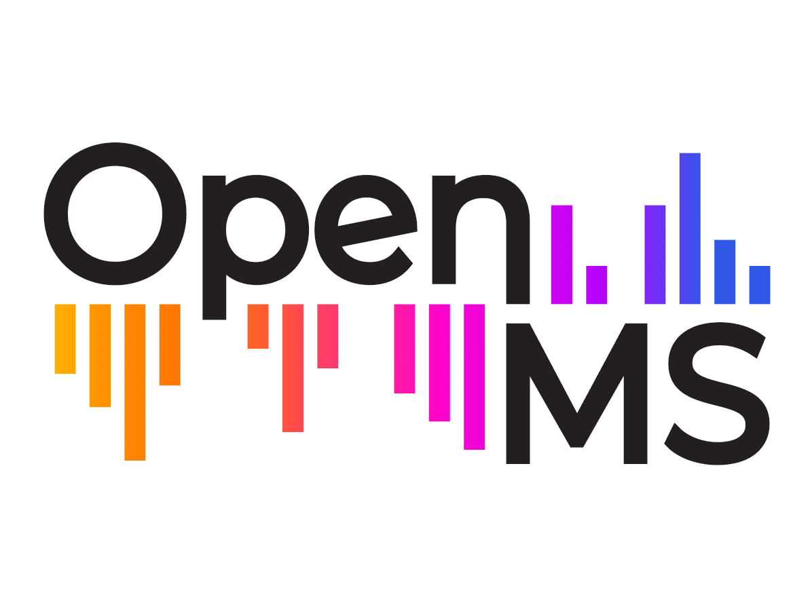

# Peptide m/z Calculator



A professional web application for mass spectrometry data analysis, developed as part of the Google Summer of Code (GSoC) project with OpenMS.

## Overview

In mass spectrometry (MS) proteomics and metabolomics, computing the mass-to-charge (m/z) ratio of peptides is a fundamental task for locating analytes in a spectrum. While this calculation is computationally straightforward and can be performed using libraries like PyOpenMS, it remains challenging for wet lab scientists with limited programming experience.

The Peptide m/z Calculator addresses this gap by providing an intuitive graphical interface that allows researchers to perform these calculations without writing code. Built with Streamlit for the frontend and PyOpenMS for the computational backend, this application makes essential mass spectrometry calculations accessible to all researchers.

## Features

### Core Functionality
- **Peptide m/z Calculation**: Calculate accurate m/z values for peptide sequences
- **Isotope Pattern Generation**: Visualize theoretical isotope patterns
- **Fragment Ion Analysis**: Generate and visualize b-ions and y-ions
- **Modification Support**: Add post-translational modifications with a user-friendly interface

### Input Options
- **Direct Sequence Entry**: Input peptide sequences manually
- **FASTA File Parsing**: Upload and parse FASTA files
- **Preset Peptides**: Select from common standard peptides
- **Batch Processing**: Analyze multiple sequences simultaneously

### Visualization
- **Interactive Plots**: Explore spectra with interactive visualizations
- **Fragment Maps**: Visualize peptide fragmentation with an interactive fragment map
- **3D Peptide Visualization**: View peptides and their modifications in 3D (optional feature)
- **Export Options**: Save visualizations in various formats

### Integration & Advanced Features
- **REST API**: Programmatic access to all calculator functions
- **OpenMS Integration**: Export to TraML, predict retention times, and more
- **Spectral Library Matching**: Compare against spectral libraries
- **Comprehensive Modification Handling**: Support for various PTMs with custom modification editor

## Installation

### Prerequisites
- Python 3.8 or higher
- PyOpenMS (2.8.0 or higher)

### Installation Steps

1. Clone the repository:
```bash
git clone https://github.com/RiturajSingh2004/peptide-mz-calculator.git
cd peptide-mz-calculator
```

2. Create a virtual environment (recommended):
```bash
python -m venv venv
source venv/bin/activate  # On Windows: venv\Scripts\activate
```

3. Install dependencies:
```bash
pip install -r requirements.txt
```

4. Run the application:
```bash
cd src
streamlit run peptide_mz_calculator/app.py
```

## Usage

### Basic Usage

1. Open the application in your web browser (typically at http://localhost:8501)
2. Select the input method: direct entry, FASTA upload, or preset peptides
3. Enter or select your peptide sequence
4. Choose the charge state
5. Add any modifications if needed
6. Click "Calculate m/z"
7. View the results and visualizations

### Batch Processing

1. Navigate to the "Batch Processing" tab
2. Upload a file containing multiple sequences (CSV, TSV, TXT, or FASTA)
3. Set processing parameters
4. Click "Process Sequences"
5. View and export the results

### Using the API

The application includes a REST API for programmatic access:

```python
import requests

# Calculate m/z for a single peptide
response = requests.post(
    "http://localhost:8000/calculate",
    json={
        "sequence": "PEPTIDE",
        "charge_state": 2,
        "modifications": [],
        "isotope_type": "monoisotopic"
    }
)

result = response.json()
print(f"m/z: {result['mz']}")
```

## Extending the Application

The modular design allows for easy extension:

1. Add new modification types in `modifications.py`
2. Implement additional visualization methods in `visualization.py`
3. Extend integration capabilities in `openms_integration.py`
4. Add new export formats in `export.py`

## Technical Details

### Architecture
- **Frontend**: Streamlit for the web interface
- **Backend**: Python modules using PyOpenMS for calculations
- **API**: FastAPI for the REST API
- **Data Handling**: Pandas for data manipulation
- **Visualization**: Plotly for interactive plots, py3Dmol for 3D visualization

### Directory Structure
```
peptide-mz-calculator/
├── data/
│   ├── example_peptides.fasta
│   ├── modifications.json
│   ├── peptide_list.csv
│   └── sequences.txt
├── src/
│   └── peptide_mz_calculator/
│       ├── __init__.py
│       ├── api.py               # REST API implementation
│       ├── app.py               # Main Streamlit application
│       ├── assets/
│       │   └── __init__.py      # Makes assets directory a Python package
│       ├── calculator.py        # Core calculation functions
│       ├── export.py            # Export utilities
│       ├── modifications.py     # Modification handling
│       ├── openms_integration.py # Integration with other OpenMS tools
│       ├── parser.py            # File format parsers
│       ├── utils.py             # Helper functions
│       └── visualization.py     # Plotting functions
├── tests/
│   └── test_calculator.py
└── README.md
```

## Google Summer of Code Project

This application was developed as part of the Google Summer of Code program for the OpenMS organization. The goal was to create a user-friendly interface for MS proteomics calculations to help wet lab scientists without programming experience.

### Project Goals
- Simplify access to mass spectrometry calculations
- Bridge the gap between computational and experimental scientists
- Extend OpenMS capabilities to web-based interfaces
- Promote open-source scientific software

## Contributing

Contributions to the Peptide m/z Calculator are welcome! Please feel free to submit a Pull Request.

## License

This project is licensed under the Apache License 2.0 - see the [LICENSE](LICENSE) file for details.

## Acknowledgments

- OpenMS development team for their guidance and support
- Google Summer of Code program for funding this project
- PyOpenMS for providing the computational backbone
- Streamlit for making web application development accessible

---

*Developed for OpenMS as part of Google Summer of Code*
